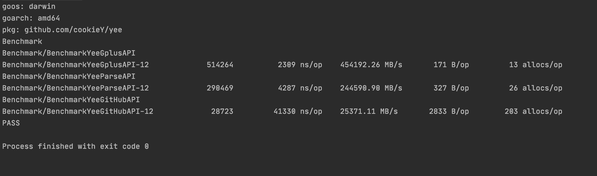

# Yee

  


🦄 Web frameworks for Go, easier & faster.
 
This is a framework for learning purposes. Refer to the code for Echo and Gin

-   Faster HTTP router
-   Build RESTful APIs
-   Group APIs
-   Extensible middleware framework
-   Define middleware at root, group or route level
-   Data binding for JSON, XML, Protocol Buffer3 and form payload
-   HTTP/2(H2C)/Http3(QUIC) support

# Supported Go versions

Yee is available as a Go module. You need to use Go 1.13 +

## Example

#### Quick start

```go
	file, err := os.OpenFile("logrus.log", os.O_CREATE|os.O_WRONLY|os.O_APPEND, 0666)
	
	if err != nil {
	    return
	}
	
	y := yee.New()
	
	y.SetLogLevel(logger.Warning)
	
	y.SetLogOut(file)
	 
	y.Use(Logger())
	 
 	y.Static("/assets", "dist/assets")

	y.GET("/", func(c yee.Context) (err error) {
		return c.HTMLTml(http.StatusOK, "dist/index.html")
	})

 	y.GET("/hello", func(c yee.Context) error {
		return c.String(http.StatusOK, "<h1>Hello Gee</h1>")
	})

	y.POST("/test", func(c yee.Context) (err error) {
		u := new(p)
		if err := c.Bind(u); err != nil {
			return c.JSON(http.StatusOK, err.Error())
		}
		return c.JSON(http.StatusOK, u.Test)
	})

        y.Run(":9000")
```

#### API 
    
Provide GET POST PUT DELETE HEAD OPTIONS TRACE PATCH
    
```go
    
  y := yee.New()
    
  y.GET("/someGet", handler)
  y.POST("/somePost", handler)
  y.PUT("/somePut", handler)
  y.DELETE("/someDelete", handler)
  y.PATCH("/somePatch", handler)
  y.HEAD("/someHead", handler)
  y.OPTIONS("/someOptions", handler)
    
  y.Run(":8000")
    
```
    
#### Restful

You can use Any & Restful method to implement your restful api

+ Any

```go
  y := yee.New()
    
  y.Any("/any", handler)
    
  y.Run(":8000")

  // All request methods for the same URL use the same handler

```

+ Restful

```go

  func userUpdate(c Context) (err error) {
  	return c.String(http.StatusOK, "updated")
  }
  
  func userFetch(c Context) (err error) {
  	return c.String(http.StatusOK, "get it")
  }
  
  func RestfulApi() yee.RestfulApi {
  	return RestfulApi{
  		Get:  userFetch,
  		Post: userUpdate,
  	}
  }
  
  y := New()
  
  y.Restful("/", testRestfulApi())
  
  y.Run(":8000")
 
// All request methods for the same URL use the different handler

 
```

## Middleware

   - basic auth
   - cors
   - crfs
   - gzip
   - jwt
   - logger
   - rate limit
   - recovery
   - secure
   - request id
   
## Benchmark
  
  Resource
  - CPU: i7-9750H
  - Memory: 16G 
  - OS: macOS 10.15.5
  
  Date: 2020/06/17
    
  
  

## License

MIT
